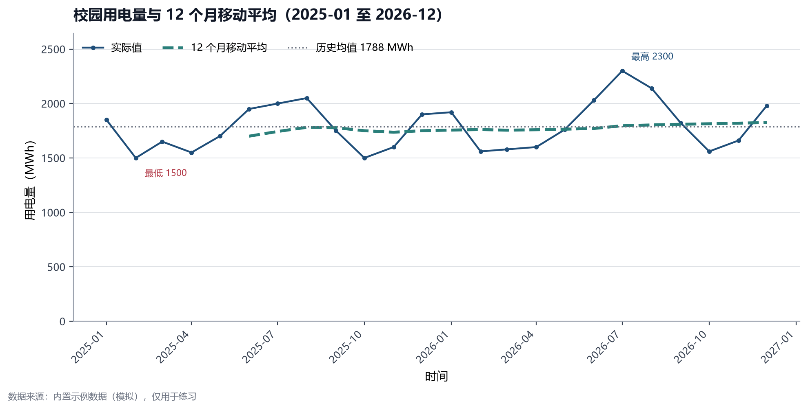
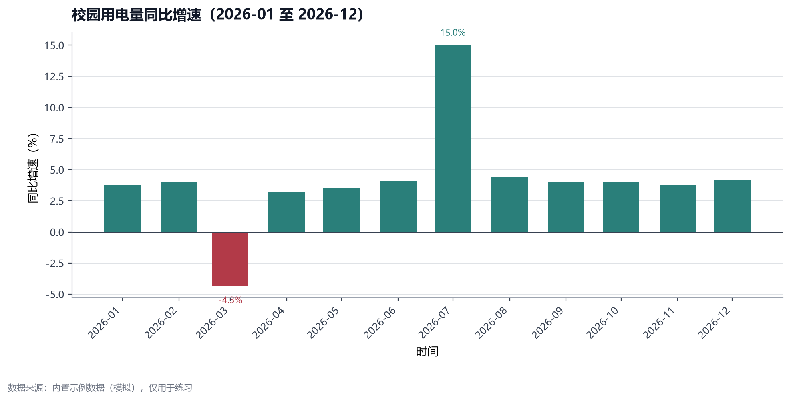

# 能源数据分析一页报告

> 姓名：××× ｜ 专业：物理学（师范） ｜ 日期：2026-××-××

## 1. 研究问题

用一句话写清楚你要回答的问题。例如：

> 校园月度用电量的高峰出现在哪些月份？气温和在校人数与用电量有什么关系？

## 2. 数据来源

| 数据 | 来源 | 时间范围 | 口径/单位 |
|---|---|---|---|
| 月度用电量 | 学校后勤/国家统计局/中电联 | 2025-01 至 2026-12 | MWh |
| 月平均气温 | 气象数据/公开统计 | 同上 | ℃ |
| 在校人数比例 | 学校公开数据/问卷估算 | 同上 | 0-1 |

说明：如果使用示例数据，必须注明"模拟数据，仅用于练习"。

## 3. 方法

1. 用 pandas 清洗日期、数字类型和缺失值。
2. 计算环比、同比和 12 个月移动平均。
3. 用 matplotlib 画趋势图和同比图。
4. 计算用电量与气温的相关系数。

## 4. 主要发现

1. 最高用电月份是：×××，原因是：×××。
2. 最低用电月份是：×××，原因是：×××。
3. 用电量与气温的相关系数是：×××，说明：×××。
4. 用电量与在校人数比例的相关系数是：×××，说明：×××。
5. 12 个月移动平均的趋势是：上升/下降/稳定。

## 5. 图表

## 6. 局限

1. 样本只有 24 个月，不能代表长期趋势。
2. 相关不等于因果，气温之外还有开学时间、设备更新、政策等因素。
3. 数据口径如果不一致，会影响同比结果。

## 7. 下一步

1. 换成真实数据，补上 3-5 年历史。
2. 加入暑假/寒假、开学周、节假日等变量。
3. 把结论转化成节能方案：空调温度管理、照明改造、光伏或储能配置。
4. 把项目升级为节能减排校赛或能源经济学术创意大赛作品。
